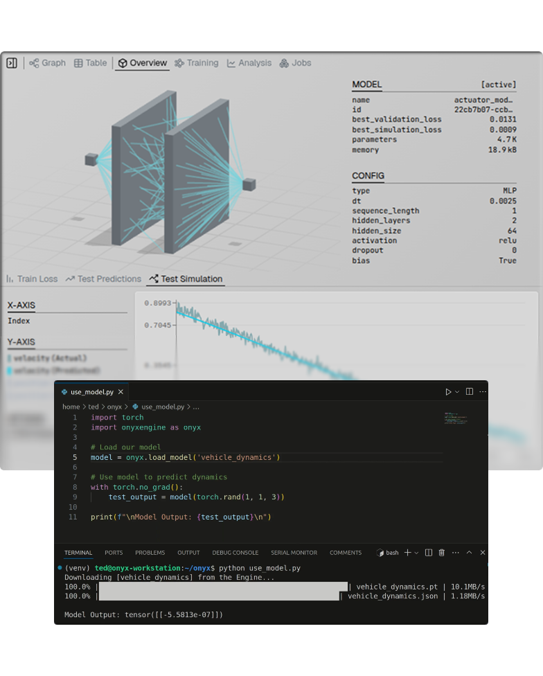

<p align="center">
  <a href="https://onyx-robotics.com">
    <picture>
      <source media="(prefers-color-scheme: dark)" srcset="assets/logo-dark.svg">
      <source media="(prefers-color-scheme: light)" srcset="assets/logo-light.svg">
      
    </picture>
  </a>
</p>

<p align="center">
  Production tooling for AI controls and simulation.
</p>

<p align="center">
  <a href="https://pypi.org/project/onyxengine/"></a>
  <a href="https://engine.onyx-robotics.com"></a>
  <a href="https://docs.onyx-robotics.com"></a>
</p>

<p align="center">
  
</p>

## What is the Onyx Engine?

The Engine is a production-ready AI training workflow for hardware control systems and physics simulation.

The **onyx-engine** Python library is your interface to:
- Upload datasets to Onyx's cloud
- Train/optimize models on Onyx's training infrastructure
- Pull and deploy models locally to predict hardware dynamics

Use our companion [Onyx Engine Platform](https://engine.onyx-robotics.com) alongside the **onyx-engine** library to accelerate your engineering.

Check out our [documentation](https://docs.onyx-robotics.com) for more information.

## Installation

```bash
pip install onyxengine
```

Configure your API key via environment variable:

```bash
export ONYX_API_KEY=your_api_key_here
```

Get your API key from our [platform](https://engine.onyx-robotics.com).

## Training Models

Define your model's inputs and outputs, configure the architecture, and train:

```python
from onyxengine import Onyx
from onyxengine.modeling import (
    Output,
    Input,
    MLPConfig,
    TrainingConfig,
    AdamWConfig,
)

# Initialize the client (defaults to ONYX_API_KEY env var)
onyx = Onyx()

# Define model outputs and inputs
outputs = [
    Output(name='acceleration'),
]
inputs = [
    Input(name='velocity', parent='acceleration', relation='derivative'),
    Input(name='position', parent='velocity', relation='derivative'),
    Input(name='control_input'),
]

# Configure the model
model_config = MLPConfig(
    outputs=outputs,
    inputs=inputs,
    dt=0.0025,
    sequence_length=8,
    hidden_layers=3,
    hidden_size=64,
    activation='relu',
    dropout=0.2,
    bias=True
)

# Configure training
training_config = TrainingConfig(
    training_iters=3000,
    train_batch_size=1024,
    test_dataset_size=500,
    checkpoint_type='multi_step',
    optimizer=AdamWConfig(lr=3e-4, weight_decay=1e-2),
    lr_scheduler=None
)

# Start training
onyx.train_model(
    model_name='example_model',
    model_config=model_config,
    dataset_name='example_data',
    training_config=training_config,
)
```

Supported architectures: **MLP**, **RNN** (RNN/LSTM/GRU), and **Transformer**.

## Optimizing Models

Search across architectures and hyperparameters to find the best model:

```python
from onyxengine import Onyx
from onyxengine.modeling import (
    Output,
    Input,
    OptimizationConfig,
    MLPOptConfig,
    RNNOptConfig,
    TransformerOptConfig,
    AdamWOptConfig,
    CosineDecayWithWarmupOptConfig,
)

# Initialize the client
onyx = Onyx()

# Define model outputs and inputs
outputs = [
    Output(name='acceleration'),
]
inputs = [
    Input(name='velocity', parent='acceleration', relation='derivative'),
    Input(name='position', parent='velocity', relation='derivative'),
    Input(name='control_input'),
]

# Model optimization configs
mlp_opt = MLPOptConfig(
    outputs=outputs,
    inputs=inputs,
    dt=0.0025,
    sequence_length={"range": [1, 10, 1]},
    hidden_layers={"select": [2, 3, 4, 5]},
    hidden_size={"select": [32, 64, 128]},
    activation={"select": ['relu', 'gelu', 'tanh']},
    dropout={"range": [0.0, 0.2, 0.1]},
    bias=True
)
rnn_opt = RNNOptConfig(
    outputs=outputs,
    inputs=inputs,
    dt=0.0025,
    rnn_type={"select": ['LSTM']},
    sequence_length={"range": [10, 30, 2]},
    hidden_layers={"select": [2, 3, 4, 5]},
    hidden_size={"select": [32, 64, 128]},
    dropout={"range": [0.0, 0.2, 0.1]},
    bias=True
)
transformer_opt = TransformerOptConfig(
    outputs=outputs,
    inputs=inputs,
    dt=0.0025,
    sequence_length={"range": [10, 40, 2]},
    n_layer={"range": [2, 4, 1]},
    n_head={"range": [2, 8, 2]},
    n_embd={"select": [24, 32, 64, 128]},
    dropout={"range": [0.0, 0.2, 0.1]},
    bias=True
)

# Optimizer config
adamw_opt = AdamWOptConfig(
    lr={"select": [5e-5, 1e-4, 3e-4, 5e-4, 8e-4]},
    weight_decay={"select": [1e-4, 1e-3, 1e-2]}
)

# Learning rate scheduler config
cos_decay_opt = CosineDecayWithWarmupOptConfig(
    max_lr={"select": [8e-5, 1e-4, 3e-4, 8e-4, 1e-3, 5e-3]},
    min_lr={"select": [1e-6, 5e-6, 1e-5, 3e-5, 5e-5]},
    warmup_iters={"select": [50, 100, 200, 400, 800]},
    decay_iters={"select": [500, 1000, 2000, 4000, 8000]}
)

# Optimization config
opt_config = OptimizationConfig(
    training_iters=3000,
    train_batch_size=1024,
    test_dataset_size=500,
    checkpoint_type='multi_step',
    opt_models=[mlp_opt, rnn_opt, transformer_opt],
    opt_optimizers=[adamw_opt],
    opt_lr_schedulers=[cos_decay_opt],
    num_trials=20
)

# Execute model optimization
onyx.optimize_model(
    model_name='example_model',
    dataset_name='example_data',
    optimization_config=opt_config,
)
```

## Deploying Models

Pull local copies of trained models from the Engine, directly from code, and simulate trajectories:

```python
import torch
from onyxengine import Onyx

# Initialize the client
onyx = Onyx()

# Load a trained model
model = onyx.load_model('example_model')

# Get model parameters
batch_size = 1
sequence_length = model.config.sequence_length
sim_steps = 100

# Create initial state tensors (batch_size, sequence_length, 1)
velocity = torch.zeros(batch_size, sequence_length, 1)
position = torch.zeros(batch_size, sequence_length, 1)

# Create external input tensor (batch_size, sequence_length + sim_steps, 1)
control_input = torch.ones(batch_size, sequence_length + sim_steps, 1)

# Run simulation
result = model.simulate(
    x0={'velocity': velocity, 'position': position},
    external_inputs={'control_input': control_input},
    sim_steps=sim_steps
)

# Access results
print("Velocity:", result.inputs['velocity'].shape)
print("Position:", result.inputs['position'].shape)
print("Acceleration:", result.outputs['acceleration'].shape)
```

For deployment without network access, models can be loaded in offline mode after initial download.

## Documentation

Full documentation is available at [docs.onyx-robotics.com](https://docs.onyx-robotics.com).

- [Quickstart](https://docs.onyx-robotics.com/quickstart)
- [Tutorials](https://docs.onyx-robotics.com/tutorials)
- [API Reference](https://docs.onyx-robotics.com/api-reference)

## License

Apache 2.0
