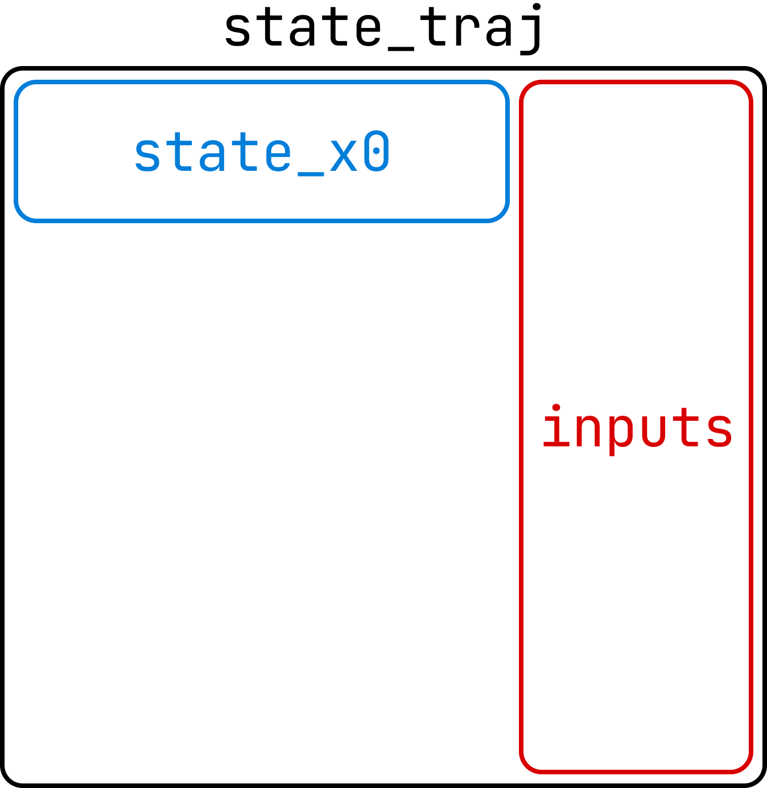

.. _simulating-models:

Simulating Models
=================

Onyx models come with built-in simulation capabilites to quickly deploy trained models.

Simulating with AI Models
---------------

To recap from :ref:`training-models`, AI models predict one step at a time by default. But for simulation and controls, we need to predict more than a single step and instead simulate trajectories over multiple steps. Managing state relations, numerical integration, and recursive model calls is tedious, so our models provide a built-in `simulate()` function to handle this for you efficiently.

To use this method, we just need to configure the model's outputs, inputs, and states. 

Once the model is trained/saved, the output-input configuration will be saved with it, so you will not need to set the outputs/inputs when loading the model.

.. code-block:: python

    from onyxengine.modeling import ( 
        Output,
        Input
    )
    import onyxengine as onyx

    # Configure outputs and inputs for a new model
    outputs = [
        Output(name='acceleration_prediction'),
    ]
    inputs = [
        Input(name='velocity', parent='acceleration_prediction', relation='derivative'),
        Input(name='position', parent='velocity', relation='derivative'),
        Input(name='control_input'),
    ]

States are similar to dynamical system state-space models, where :math:`\dot{x} = f(x, u)`. In this example:

- Model Outputs
    - **acceleration** (:math:`\dot{x}`) is the output of the model.
- Model Inputs
    - **velocity** (:math:`x_1`) is the first state, whose parent **acceleration** is its derivative.
    - **position** (:math:`x_2`) is the second state, whose parent **velocity** is its derivative.
    - **control_input** (:math:`u`) is a control input, whose value is known at each time step.

The standard inputs are given at each time step, and outputs are predicted by the model, so they do not need any special attention.

The **states**, however, must be calculated from the outputs (or other states) and fed back into the model as inputs to simulate a trajectory. The available relations between states and their parents are:

- **"output"**: The state is equal to an output of the model.
    
    - :math:`\text{state}_{t+1} = \text{parent}_t`

- **"delta"**: The parent is the delta of the state.

    - :math:`\text{state}_{t+1} = \text{state}_t + \text{parent}_t`

- **"derivative"**: The parent is the derivative of the state.

    - :math:`\text{state}_{t+1} = \text{state}_t + \text{parent}_t \cdot \text{dt}`

.. Note::
    
    Often it can be easier for a hardware AI model to predict the delta or derivative of a feature than the feature itself.

simulate()
----------

We will now use the :meth:`simulate` method on a model. Here is the example code:

.. code-block:: python

    import torch
    import onyxengine as onyx

    # Load our model
    model = onyx.load_model('example_model')
    total_inputs = len(model.config.inputs)
    num_states = len([s for s in model.config.inputs if s.relation is not None])
    num_inputs = total_inputs - num_states

    # Example 1: Run inference with our model (using normal pytorch model prediction)
    batch_size = 1
    seq_length = model.config.sequence_length
    test_input = torch.ones(batch_size, seq_length, total_inputs)
    with torch.no_grad():
        test_output = model(test_input)
    print(test_output)
    
    # Example 2: Simulate a trajectory with our model
    # Model will fill in the x_traj tensor with the simulated trajectory
    sim_steps = 10
    state_x0 = torch.ones(batch_size, seq_length, num_states)
    inputs = torch.ones(batch_size, seq_length+sim_steps, num_inputs)
    state_traj = torch.zeros(1, seq_length+sim_steps, total_inputs)
    model.simulate(state_traj, state_x0, inputs)
    print(state_traj)

To make the :meth:`simulate` method performant, we avoid using dynamic memory allocation by passing in the pre-allocated tensors needed:

.. raw:: html

      

- **state_traj** - The state trajectory tensor whose values will be "filled in" with the simulated trajectory. 

    - Should be of shape (batch_size, sim_steps, model_inputs):
    
        - **batch_size** is the number of parallel trajectories to simulate
        - **sim_steps** is the number of time steps to simulate
        - **model_inputs** is the total number of inputs to the model (num_states + num_inputs).

- **state_x0** - The initial state for the simulation, and the first `sequence_length` state values of the traj_solution tensor. 

    - Should be of shape (batch_size, seq_length, num_states)

- **inputs** - The complete array of non-state inputs for the simulation. 

    - Should be of shape (batch_size, sim_steps, num_inputs)

- **(Optional) model_outputs** - Optionally, you can pass a tensor to obtain the model outputs 

    - Should be of shape (batch_size, sim_steps, num_outputs)

The batch dimension allows for parallel simulation of multiple trajectories, which is where GPU acceleration becomes useful.

If you need to run some code (such as a controller) at each time step, you can use the simulate method in a loop and simulate one step at a time.
